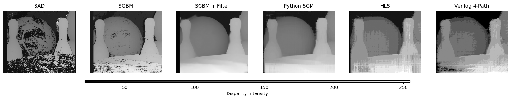
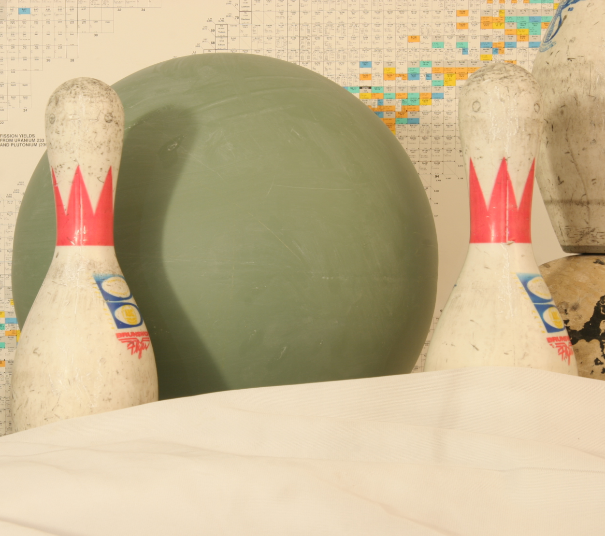
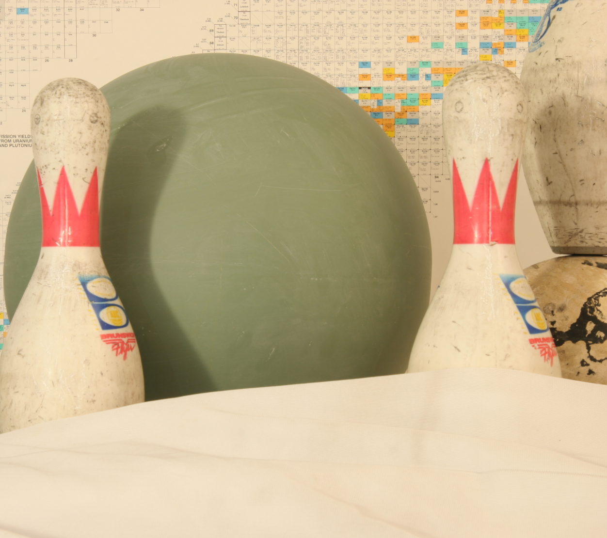
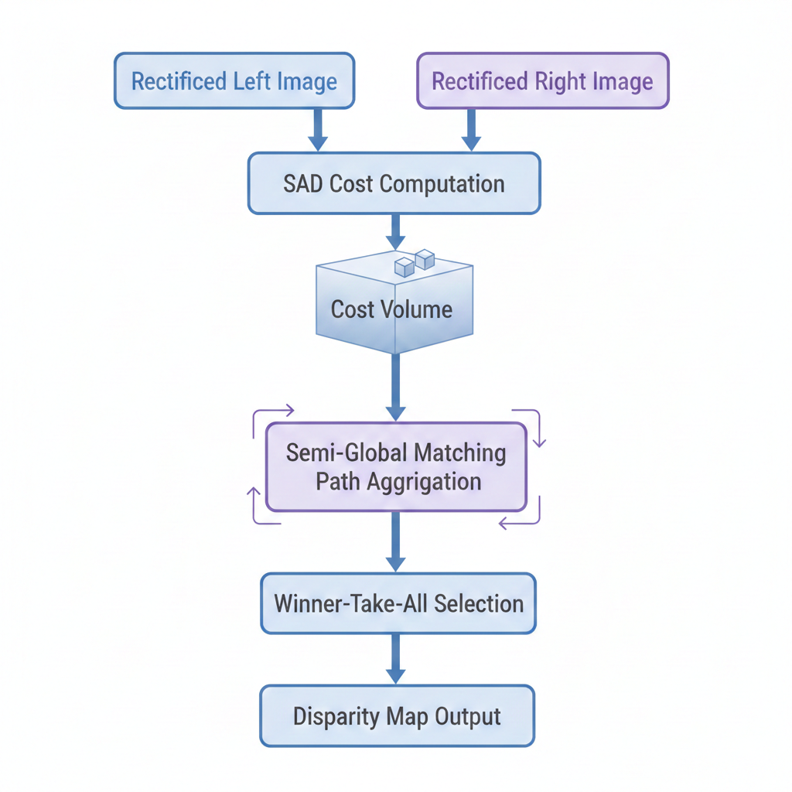
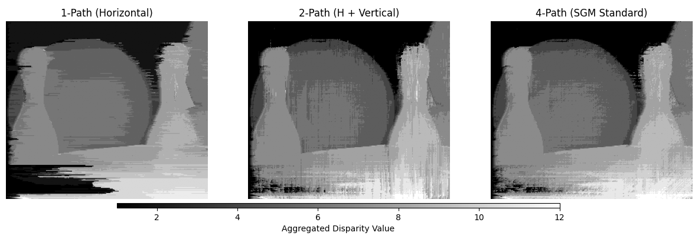

# Stereo Depth Estimation — SGM-Based (From Python to FPGA)

## Abstract

This repository presents a complete, validation-driven workflow for **stereo depth estimation** based on the **Semi-Global Matching (SGM)** algorithm.

The project demonstrates how a computationally intensive stereo matching algorithm can be:

- rigorously developed and validated in Python,
- systematically transformed into hardware-oriented implementations,  
- evaluated across multiple abstraction levels, from software baselines to RTL hardware outputs.

Particular emphasis is placed on algorithmic transparency, reproducibility, and structured cross-validation.  
The workflow highlights key architectural trade-offs, including path aggregation strategies, memory constraints, and the balance between disparity quality and hardware efficiency.

<p align="center">
  
</p>

<p align="center">
<b>An end-to-end stereo depth estimation workflow using Semi-Global Matching (SGM),<br>
bridging algorithmic reference models and FPGA-oriented architectures.</b>
</p>

---

## Table of Contents

- [Abstract](#abstract)
- [Project Overview](#project-overview)
- [Problem Context: Stereo Depth Estimation](#problem-context-stereo-depth-estimation)
- [Design Flow Overview](#design-flow-overview)
- [Algorithm at a Glance](#algorithm-at-a-glance)
- [FPGA-Oriented Design Decisions](#fpga-oriented-design-decisions)
- [Results & Visual Comparison](#results--visual-comparison)
- [Dependencies & Execution Environment](#dependencies--execution-environment)
- [Input / Output Data Configuration](#input--output-data-configuration)
- [Repository Structure](#repository-structure)
- [Contributing](#contributing)
- [License](#license)

---

## Project Overview

This repository investigates an **algorithm-to-architecture co-design workflow** for stereo depth estimation using **Semi-Global Matching (SGM)**.

A fully transparent, from-scratch **Python implementation** serves as the algorithmic reference model. It enables controlled experimentation and systematic analysis of:

- matching cost computation,
- smoothness penalties (\(P_1, P_2\)),
- disparity range selection,
- and multi-path aggregation strategies.

Once validated, the reference logic is translated into:

- **HLS-style C++** for hardware synthesis, and  
- **Verilog RTL** implementations optimized for FPGA deployment.

The hardware-oriented designs explicitly address practical constraints such as streaming dataflow, limited on-chip buffering, fixed-point arithmetic, and path-reduction trade-offs (1-path, 2-path, and 4-path variants).

This structured progression ensures pixel-level consistency between software and hardware implementations while enabling systematic evaluation of quality–complexity trade-offs.

---

## Problem Context: Stereo Depth Estimation

Stereo depth estimation recovers scene geometry by matching corresponding points between two horizontally displaced images.  
The **disparity**—the horizontal pixel shift between corresponding points—is inversely proportional to depth.

While local matching methods are computationally efficient, they often suffer from:
- noise,
- streaking artifacts,
- poor performance in low-texture or occluded regions.

**Semi-Global Matching (SGM)** improves robustness by enforcing smoothness along multiple 1-D paths, achieving a balance between local accuracy and global consistency—at the cost of increased computational and memory complexity.

<p align="center">
  
  
  
</p>

<p align="center">
  <em>Figure: Left image, right image, and ground-truth disparity map.</em>
</p>

---

## Design Flow Overview

The workflow follows a structured, validation-driven approach:

1. **Library-Based Baseline (OpenCV)**  
   Establishes an initial quality reference using standard stereo matching implementations.

2. **Python From-Scratch Implementation**  
    A transparent SGM implementation for understanding the algorithm, verifying correctness, and comparing with library versions.

3. **FPGA-Oriented Simplification**  
   Algorithm parameters are constrained to reflect realistic memory, bandwidth, and streaming considerations.

4. **HLS-Style C++ Implementation**  
   Hardware-friendly translation emphasizing fixed-point arithmetic and line-based processing.

5. **Verilog RTL Path Variants**  
   Cycle-accurate RTL implementations with 1-path, 2-path, and 4-path aggregation to study quality–complexity trade-offs.

---

## Algorithm at a Glance

The SGM pipeline consists of four core stages:

<p align="center">
  
</p>

<p align="center">
  <em>Figure: End-to-end SGM development.</em>
</p>

### 1️⃣ Matching Cost Computation (SAD)

Computes similarity between pixel windows using **Sum of Absolute Differences**:

$$
C(x, y, d) = \sum_{(i,j) \in W} \big| I_L(x+i, y+j) - I_R(x+i-d, y+j) \big|
$$

- \(C(x, y, d)\): cost of matching pixel \((x,y)\) with disparity \(d\)  
- \(I_L, I_R\): left and right images  
- \(W\): local window around \((x,y)\)

**Caption:** Low cost → likely correct match; high cost → unlikely match.

---

### 2️⃣ Cost Volume Generation

Generates a **3D cost volume** for all disparity candidates:

$$
C(x, y, d) \in \mathbb{R}^{H \times W \times D}
$$

- **H, W**: image height and width  
- **D**: maximum disparity  
- Each slice at disparity `d` (denoted `C[:,:,d]`) represents the cost map for that disparity

**Caption:** Serves as input for path-wise aggregation.

---

### 3️⃣ Path-wise Cost Aggregation (SGM)

Aggregates costs along multiple paths to enforce smoothness:

$$
L_r(p, d) = C(p, d) + \min \left[
\begin{array}{ll}
L_r(p-r, d) \\
L_r(p-r, d-1) + P_1 \\
L_r(p-r, d+1) + P_1 \\
\min_k L_r(p-r, k) + P_2
\end{array}
\right] - \min_k L_r(p-r, k)
$$

- **$L_r(p, d)$**: Aggregated cost at pixel $p$ with disparity $d$ along path $r$
- **$P_1$**: Penalty for small disparity changes ($\pm 1$ pixel)
- **$P_2$**: Penalty for larger disparity jumps ($> 1$ pixel)
- Multiple paths (horizontal, vertical, diagonal) are summed for the final cost.

**Caption:** Preserves object boundaries while smoothing disparities.

---

### 4️⃣ Disparity Selection (Winner-Take-All, WTA)

Selects the disparity with minimum aggregated cost:

$$
d^*(x,y) = \arg\min_d \sum_r L_r(x, y, d)
$$

- Produces a **dense, consistent disparity map**  
- Used as reference for HLS and Verilog validation

---

## FPGA-Oriented Design Decisions

Key design choices reflecting hardware constraints include:

- **Resolution**: 272 × 240  
- **Disparity Range**: 16 or 64  
- **Path Variants**:
  - 1-path: minimal complexity, visible streaking
  - 2-path: improved consistency
  - 4-path: best visual quality
- **Fixed-Point Arithmetic** to reduce complexity and improve determinism

These parameters enable controlled exploration of quality–complexity trade-offs.

---

## Results & Visual Comparison

The following visualization compares all implemented methods, from library baselines to hardware-oriented outputs:

<p align="center">
  
</p>

<p align="center">
  <em>Figure: Disparity maps for all implemented methods — SAD, OpenCV SGBM, OpenCV SGBM+WLS, Python SGM, HLS C++, and Verilog 4-path RTL implementation.</em>
</p>

### Methods Overview

The following implementations are evaluated to demonstrate the progression from software-based baselines to hardware-oriented realizations of the SGM algorithm:

| Method | Description |
|--------|-------------|
| **SAD (Sum of Absolute Differences)** | OpenCV-based local block-matching baseline using fixed window aggregation; provides a simple and computationally efficient reference. |
| **OpenCV SGBM (Reference)** | Standard OpenCV Semi-Global Block Matching implementation used as the primary software benchmark for quality comparison. |
| **OpenCV SGBM + WLS Filter** | SGBM output refined using a Weighted Least Squares (WLS) post-processing filter to enhance edge preservation and reduce noise in homogeneous regions. |
| **Python SGM** | Fully custom, from-scratch implementation of the complete SGM pipeline, including cost computation, smoothness penalties (\(P_1, P_2\)), and multi-path aggregation. Serves as the algorithmic reference for hardware validation. |
| **HLS (C++ Synthesis)** | Hardware-oriented implementation derived from the Python SGM logic and adapted for High-Level Synthesis, incorporating fixed-point arithmetic and streaming constraints. |
| **Verilog (4-Path RTL)** | Cycle-accurate RTL implementation with four-path cost aggregation, optimized for FPGA deployment and improved disparity consistency. |

---

### Key Observations

- **Software Baselines (SAD / OpenCV SGBM / SGBM + WLS)**  
  Provide fast disparity estimation and establish quality benchmarks. The WLS-filtered variant improves smoothness and reduces noise, particularly in low-texture regions.

- **Python SGM**  
  Produces dense and consistent disparity maps, enabling transparent inspection of all algorithmic stages and serving as the validation reference for subsequent hardware implementations.

- **HLS and Verilog Implementations**  
  Preserve the structural and visual characteristics of the Python SGM results while adhering to fixed-point arithmetic and streaming constraints, demonstrating a successful transition from algorithm to hardware.

- **Path Aggregation Impact (1-Path → 4-Path)**  
  Increasing the number of aggregation paths progressively reduces streaking artifacts, enhances depth continuity, and improves overall disparity completeness, at the cost of additional computational and memory complexity.

<p align="center">
  
</p>

<p align="center">
  <em>Figure: Comparison of 1-path, 2-path, and 4-path aggregation. Increasing the number of paths reduces streaking artifacts and improves depth continuity.</em>
</p>

---

## Dependencies & Execution Environment

This project spans algorithmic development (Python), High-Level Synthesis (HLS), and RTL verification (Verilog).  
The following tools and libraries were used to ensure deterministic cross-validation across all stages.

---

### Python Environment

**Required:**
- Python 3.8+
- Jupyter Notebook

**Libraries:**
```python
import cv2
import numpy as np
from PIL import Image
import matplotlib.pyplot as plt
```

Install dependencies using:

```bash
pip install opencv-python numpy pillow matplotlib
```

The primary algorithmic reference and evaluation framework is provided in:

```
Stereo_Depth_Estimation.ipynb
```

This notebook:
- Implements the full SGM pipeline from scratch
- Generates processed pixel streams for hardware validation
- Performs visual and numerical comparison across all methods

---

### FPGA & Hardware Toolchain

- **Xilinx Vivado 2019.1**
  - Used for HLS C++ synthesis
  - Used for C-Simulation and RTL Co-Simulation
  - Used for Verilog RTL simulation

> ⚠️ The project was developed and validated using Vivado 2019.1.  
> Later Vivado versions may require minor project configuration updates.

---

## Input / Output Data Configuration

The HLS and Verilog implementations rely on file-based pixel streaming to enable deterministic comparison against the Python reference model.

Proper path configuration is required before simulation.

---

### HLS Testbench Configuration

The HLS testbench (`main_tb.cpp`) defines dataset and result paths using compile-time macros:

```cpp
#ifndef DATA_PATH
#define DATA_PATH "../../../data/processed/"
#endif

#ifndef RESULT_PATH
#define RESULT_PATH "../../../results/"
#endif
```

**Expected input files:**
```
data/processed/left_pixels.txt
data/processed/right_pixels.txt
```

**Generated output:**
```
results/hls_disparity.txt
```

If your Vivado project directory differs, adjust `DATA_PATH` and `RESULT_PATH` accordingly.

---

### Verilog RTL Testbench Configuration

The RTL comparison testbench loads pixel streams using:

```verilog
$readmemh("../../../data/processed/left_pixels.hex",  memory_left);
$readmemh("../../../data/processed/right_pixels.hex", memory_right);
```

**Generated outputs:**
```
results/verilog_disparity_1path.txt
results/verilog_disparity_2path.txt
results/verilog_disparity_4path.txt
```

Before simulation, ensure that:

- The relative paths match your simulation working directory
- The `data/processed/` directory contains correctly formatted `.txt` and `.hex` pixel streams
- The `results/` directory exists

---

## Repository Structure

```text
stereo-depth-estimation-sgm/
├── data/                         # Rectified stereo image pairs for evaluation and testing
├── diagram/                      # Algorithmic and architectural block diagrams
├── hls/                          # HLS-style C++ implementations targeting FPGA synthesis
├── results/                      # Generated disparity maps and visual comparison outputs
├── verilog/                      # RTL modules including cost aggregation paths and WTA logic
├── Stereo_Depth_Estimation.ipynb # Primary Jupyter Notebook: Python reference implementation,
│                                 # documentation, validation, and cross-comparison framework
├── .gitignore                    # Git ignore rules
├── LICENSE                       # MIT License and project legal information
└── README.md                     # Project documentation and usage guide
```

---

## Contributing

Contributions are welcome! If you have suggestions or improvements, feel free to fork the repository and create a pull request.

### Steps to Contribute:

1. Fork the repository.
2. Create a new branch:
   ```bash
   git checkout -b feature-name
   ```
3. Commit your changes:
   ```bash
   git commit -m "Description of changes"
   ```
4. Push the changes and open a pull request.

---

## License
This project is licensed under the MIT License. See the [LICENSE](LICENSE) file for more details.
